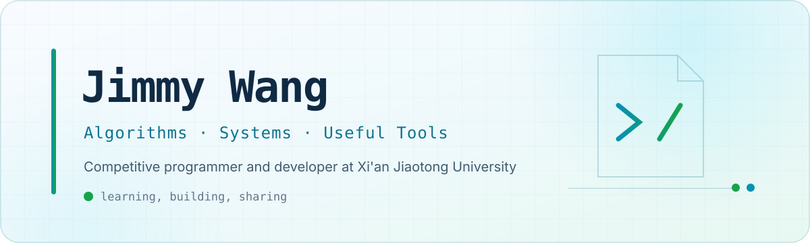
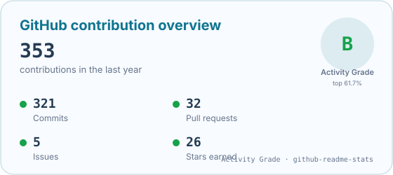
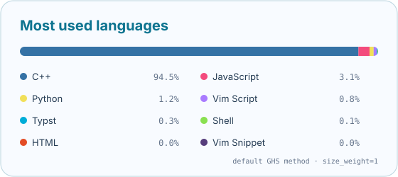

<picture>
  <source media="(prefers-color-scheme: dark)" srcset="./assets/profile-banner-dark.svg" />
  <source media="(prefers-color-scheme: light)" srcset="./assets/profile-banner-light.svg" />
  
</picture>

 

<a href="https://github.com/JimmyWang0417">GitHub</a>
&nbsp;&nbsp;·&nbsp;&nbsp;
<a href="https://www.cnblogs.com/wangjunrui">Blog</a>
&nbsp;&nbsp;·&nbsp;&nbsp;
<a href="mailto:jimmywang0417@gmail.com">Email</a>

  

<table>
  <tr>
    <td align="center" width="20%">
       
      <strong>C++</strong> algorithms &amp; systems
    </td>
    <td align="center" width="20%">
       
      <strong>Python</strong> automation &amp; tooling
    </td>
    <td align="center" width="20%">
       
      <strong>JavaScript</strong> web &amp; dashboards
    </td>
    <td align="center" width="20%">
       
      <strong>Markdown</strong> notes &amp; documentation
    </td>
    <td align="center" width="20%">
       
      <strong>Linux</strong> daily environment
    </td>
  </tr>
  <tr>
    <td align="center">
      <picture>
        <source media="(prefers-color-scheme: dark)" srcset="./assets/icons/minecraft-dark.svg" />
        <source media="(prefers-color-scheme: light)" srcset="./assets/icons/minecraft-light.svg" />
        
      </picture> 
      <strong>Minecraft</strong> redstone &amp; building
    </td>
    <td align="center">
      
       
      <strong>Competitive Programming</strong> contests &amp; templates
    </td>
    <td align="center">
      <picture>
        <source media="(prefers-color-scheme: dark)" srcset="./assets/icons/codex-dark.svg" />
        <source media="(prefers-color-scheme: light)" srcset="./assets/icons/codex-light.svg" />
        
      </picture> 
      <strong>Codex</strong> primary coding agent
    </td>
    <td align="center">
       
      <strong>Claude Code</strong> coding agent
    </td>
    <td align="center">
       
      <strong>Git</strong> version control
    </td>
  </tr>
</table>

 

  <h2>About me</h2>

I enjoy turning hard algorithmic ideas into concise, reusable code. Most of my work lives around competitive programming, developer tools, Linux, and the occasional Minecraft redstone build.

- 🎓 Software Engineering at Xi'an Jiaotong University
- 🧩 Competitive programmer and algorithm enthusiast
- 🛠️ Building with C++, Python, and JavaScript
- 🤖 AI coding agents of choice: Codex and Claude Code
- 🐧 Daily Linux user
- ⚡ Minecraft redstone enjoyer

  <h2>GitHub at a glance</h2>

  <picture>
    <source media="(prefers-color-scheme: dark)" srcset="./assets/github-stats-dark.svg" />
    <source media="(prefers-color-scheme: light)" srcset="./assets/github-stats-light.svg" />
    
  </picture>
  <picture>
    <source media="(prefers-color-scheme: dark)" srcset="./assets/top-languages-dark.svg" />
    <source media="(prefers-color-scheme: light)" srcset="./assets/top-languages-light.svg" />
    
  </picture>

  Updated automatically every day · Activity Grade follows the <a href="https://github.com/anuraghazra/github-readme-stats#github-stats-card">github-readme-stats</a> algorithm · Languages use its default byte-count method.

  <h2>Featured work</h2>

<table>
  <tr>
    <td width="50%" valign="top">
      <h3>01 · <a href="https://github.com/JimmyWang0417/Competitive-Programming-Templates">Competitive Programming Templates</a></h3>
      
A compact, documented C++ template library for contests—from data structures and graph theory to number theory and polynomials.

      

        
        
        
        
      

      

    </td>
    <td width="50%" valign="top">
      <h3>02 · <a href="https://github.com/JimmyWang0417/Algorithm-Competitive-Codes">Algorithm Competitive Codes</a></h3>
      
My long-running collection of solutions, experiments, and notes from online judges and programming contests.

      

        
        
        
        
      

      

    </td>
  </tr>
  <tr>
    <td width="50%" valign="top">
      <h3>03 · <a href="https://github.com/JimmyWang0417/oj-activity-monitor">OJ Activity Monitor</a></h3>
      
A browser-based dashboard for tracking recent submissions and solved problems across multiple online judges.

      

        
        
        
        
      

      

    </td>
    <td width="50%" valign="top">
      <h3>04 · <a href="https://github.com/JimmyWang0417/XJTUSE-Courses">XJTUSE Courses</a></h3>
      
Course documents and learning resources collected for Software Engineering students at XJTU.

      

        
        
        
        
      

      

    </td>
  </tr>
</table>

  <h2>Core contributions</h2>

<table>
  <tr>
    <td width="50%" valign="top">
      <h3><a href="https://github.com/yan-xiaoo/XJTUToolBox">XJTUToolBox</a></h3>
      
A widely used campus toolbox for attendance, timetables, course evaluation, and other XJTU services.

      

        
        
        
        
        
        
      

      
<a href="https://github.com/yan-xiaoo/XJTUToolBox/commits?author=JimmyWang0417"><strong>View my contributions →</strong></a>

    </td>
    <td width="50%" valign="top">
      <h3><a href="https://github.com/clyzcst/clyzcst.github.io">BibleCollection</a></h3>
      
A maintained collection site and supporting toolchain for curated community content.

      

        
        
        
        
        
      

      
<a href="https://github.com/clyzcst/clyzcst.github.io/commits?author=JimmyWang0417"><strong>View my contributions →</strong></a>

    </td>
  </tr>
</table>

  <h2>What I care about</h2>

| Clear abstractions | Reliable tooling | Knowledge sharing |
| :---: | :---: | :---: |
| Small interfaces, strong guarantees, and code that stays readable under contest pressure. | Tools that remove repetitive work and make useful information easier to reach. | Templates, notes, and projects that remain understandable after the problem is solved. |

 

  Thanks for stopping by. Feel free to explore the repositories or say hello.

