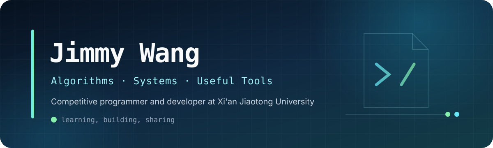

 

<a href="https://github.com/JimmyWang0417">GitHub</a>
&nbsp;&nbsp;·&nbsp;&nbsp;
<a href="https://www.cnblogs.com/wangjunrui">Blog</a>
&nbsp;&nbsp;·&nbsp;&nbsp;
<a href="mailto:jimmywang0417@gmail.com">Email</a>

  

<code>C++</code>&nbsp;
<code>Python</code>&nbsp;
<code>JavaScript</code>&nbsp;
<code>Linux</code>&nbsp;
<code>Competitive Programming</code>

 

  <h2>About me</h2>

I enjoy turning hard algorithmic ideas into concise, reusable code. Most of my work lives around competitive programming, developer tools, Linux, and the occasional Minecraft redstone build.

- 🎓 Software Engineering at Xi'an Jiaotong University
- 🧩 Competitive programmer and algorithm enthusiast
- 🛠️ Building with C++, Python, and JavaScript
- 🐧 Daily Linux user
- ⚡ Minecraft redstone enjoyer

  <h2>Featured work</h2>

<table>
  <tr>
    <td width="50%" valign="top">
      <h3><a href="https://github.com/JimmyWang0417/Competitive-Programming-Templates">Competitive Programming Templates</a></h3>
      
A compact, documented C++ template library for contests—from data structures and graph theory to number theory and polynomials.

      
<code>C++</code> <code>Algorithms</code> <code>Templates</code>

    </td>
    <td width="50%" valign="top">
      <h3><a href="https://github.com/JimmyWang0417/Algorithm-Competitive-Codes">Algorithm Competitive Codes</a></h3>
      
My long-running collection of solutions, experiments, and notes from online judges and programming contests.

      
<code>C++</code> <code>OJ</code> <code>Problem Solving</code>

    </td>
  </tr>
  <tr>
    <td width="50%" valign="top">
      <h3><a href="https://github.com/JimmyWang0417/oj-activity-monitor">OJ Activity Monitor</a></h3>
      
A browser-based dashboard for tracking recent submissions and solved problems across multiple online judges.

      
<code>JavaScript</code> <code>Dashboard</code> <code>Tooling</code>

    </td>
    <td width="50%" valign="top">
      <h3><a href="https://github.com/JimmyWang0417/XJTUSE-Courses">XJTUSE Courses</a></h3>
      
Course documents and learning resources collected for Software Engineering students at XJTU.

      
<code>Notes</code> <code>Resources</code> <code>XJTU</code>

    </td>
  </tr>
</table>

  <h2>What I care about</h2>

| Clear abstractions | Reliable tooling | Knowledge sharing |
| :---: | :---: | :---: |
| Small interfaces, strong guarantees, and code that stays readable under contest pressure. | Tools that remove repetitive work and make useful information easier to reach. | Templates, notes, and projects that remain understandable after the problem is solved. |

 

  Thanks for stopping by. Feel free to explore the repositories or say hello.

